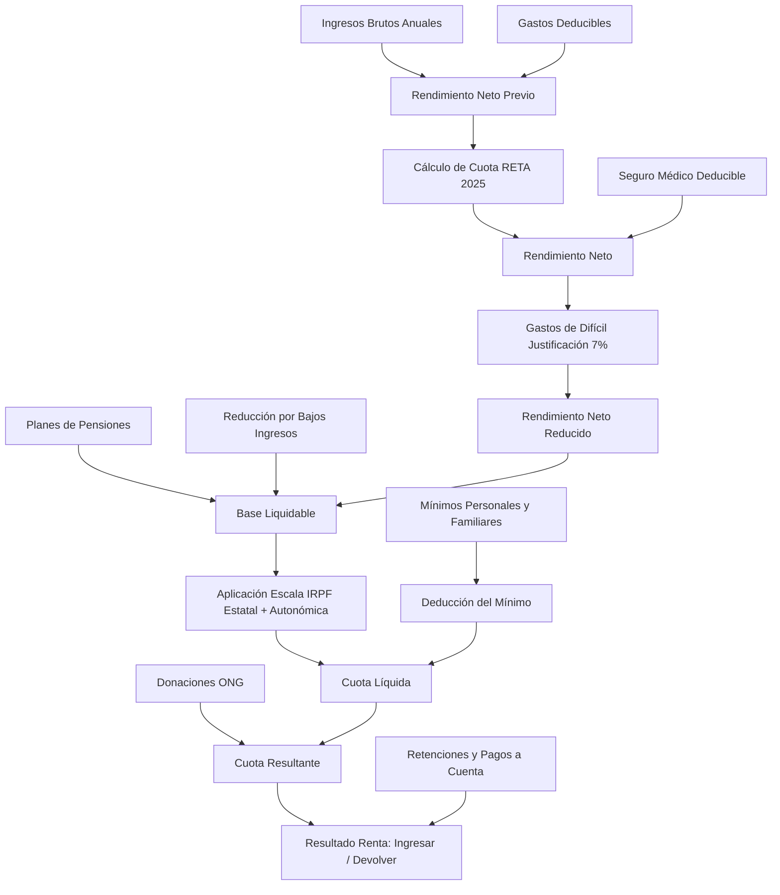

# Simulador de Autónomos España 🇪🇸

Simulador simplificado y 100% privado para calcular el **IRPF** y la **cuota de autónomos (RETA)** del año 2025 en España. Desarrollado como un experimento de [Lostium](https://lostium.com) utilizando **Angular 21** y **Tailwind CSS 4**.


---

## 🎯 ¿Qué hace este Simulador?

La herramienta está diseñada para estimar la carga fiscal y la cotización a la Seguridad Social de un autónomo en España para el ejercicio **2025**. Permite simular diferentes escenarios de ingresos, gastos y deducciones, calculando el resultado esperado de la declaración de la renta.

### 🧮 Lógica de Cálculo y Flujo Fiscal

El simulador implementa el flujo de cálculo oficial siguiendo la normativa española:



#### 1. Cotización a la Seguridad Social (RETA 2025)
* El simulador utiliza el **sistema de cotización por ingresos reales**.
* **Cálculo de la base de cotización**: Estima el promedio mensual de los rendimientos netos (Ingresos - Gastos deducibles) y determina el tramo correspondiente en las tablas oficiales del RETA de 2025.
* **Autónomo Societario**: Si se marca la casilla correspondiente, se aplica una **base mínima de cotización de 1.000 € mensuales** en el cálculo, conforme a la legislación específica para este perfil.

#### 2. Gastos de Difícil Justificación
* Aplica una deducción automática del **7%** sobre el rendimiento neto (con un límite máximo de 2.000 € anuales) para autónomos individuales, siempre que se marque la opción de gastos de difícil justificación.

#### 3. Deducciones Generales y Reducciones
* **Seguros Médicos**: Deducción de las primas pagadas para el autónomo, cónyuge e hijos menores de 25 años, con un límite de 500 € por persona (1.500 € en caso de discapacidad).
* **Planes de Pensiones**: Deducción de aportaciones a planes de pensiones individuales (límite de 1.500 €) y planes de empleo simplificados para autónomos (límite adicional de 4.250 €).
* **Reducción por obtención de rendimientos del trabajo/actividades**: Reducción aplicada de forma progresiva a rentas netas bajas.

#### 4. Mínimos Personales y Familiares
* Se deducen los mínimos personales en función de la edad del contribuyente (base general, >65 años y >75 años).
* Deducciones familiares por número de hijos a cargo.

#### 5. Escala de IRPF (Tramo Estatal y Autonómico)
* Combina la escala del **tramo estatal** con las escalas específicas de las **Comunidades Autónomas** soportadas (Comunidad de Madrid, Andalucía, Cataluña, Comunidad Valenciana, Galicia, Región de Murcia y Canarias).
* Para el resto de autonomías se aplica la escala del territorio común.

#### 6. Retenciones y Resultado Final
* Se restan las retenciones soportadas durante el año o los pagos a cuenta del Modelo 130 para dar con el resultado final de la declaración (A ingresar o a devolver).

---

## 🛠️ Stack Tecnológico

* **Angular 21**: Arquitectura moderna basada en Standalone Components, Reactividad nativa con **Signals**, y el nuevo flujo de control nativo (`@if`/`@for`).
* **Tailwind CSS 4**: Utiliza el nuevo motor de compilación ultrarrápido Oxide y variables nativas CSS.
* **@ngrx/signals**: Almacenamiento y gestión de estado local simple y tipada.
* **Angular i18n**: Internacionalización nativa con soporte para traducciones en formato XLIFF 2.0.
* **Service Workers / PWA**: Aplicación instalable para móviles y ordenadores con soporte offline y notificaciones de actualización automática.
* **Vitest**: Suite de tests unitarios rápida que valida los cálculos de IRPF e integraciones del sistema.

---

## 🌐 Idiomas Soportados

La aplicación cuenta con traducción completa en los siguientes idiomas:
* 🇪🇸 **Español** (`es` - predeterminado)
* 🇬🇧 **Inglés** (`en`)
* 🇩🇰 **Catalán** (`ca`)
* 🇪🇸 **Gallego** (`gl`)
* 🇪🇸 **Euskera** (`eu`)

---

## 🚀 Instalación y Desarrollo Local

### Prerrequisitos
* Node.js v20+
* **pnpm** (gestor de paquetes recomendado)

```bash
# Instalar dependencias
pnpm install

# Iniciar servidor de desarrollo (Español)
pnpm start

# Iniciar servidor de desarrollo en un idioma específico (ej. Inglés)
pnpm run ng serve --configuration=en
```

### Ejecutar Tests
```bash
# Ejecutar tests unitarios con Vitest
pnpm test
```

### Generar la Build de Producción
```bash
# Compilar todos los idiomas
pnpm build
```
Las compilaciones localizadas se exportarán en carpetas independientes bajo `dist/simulador-autonomos/browser/`.

---

## 🔒 Privacidad y Disclaimer

1. **100% Local**: No se transmiten datos financieros ni personales a ningún servidor externo. Todo el proceso de cálculo ocurre dentro del navegador del usuario. El historial de simulaciones se guarda de forma segura únicamente en el `localStorage` local.
2. **Carácter Informativo**: Este simulador ofrece una estimación de acuerdo a la normativa general del IRPF y Seguridad Social para 2025. **No reemplaza el criterio y asesoramiento personalizado de un gestor profesional o asesor fiscal.**
3. **Bajo su cuenta y riesgo**: Use por su cuenta y riesgo la aplicación. Lostium no se responsabiliza de fallos o errores de cálculo; es simplemente un experimento para uso interno que hemos dejado abierto para que otras personas lo deriven.

---

**Desarrollado con ❤️ por [Lostium](https://lostium.com)**
